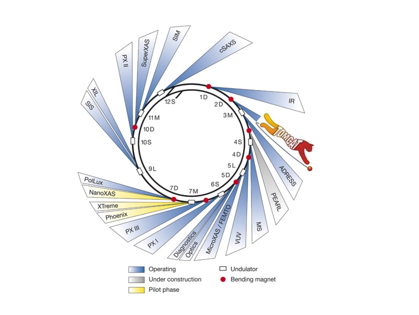
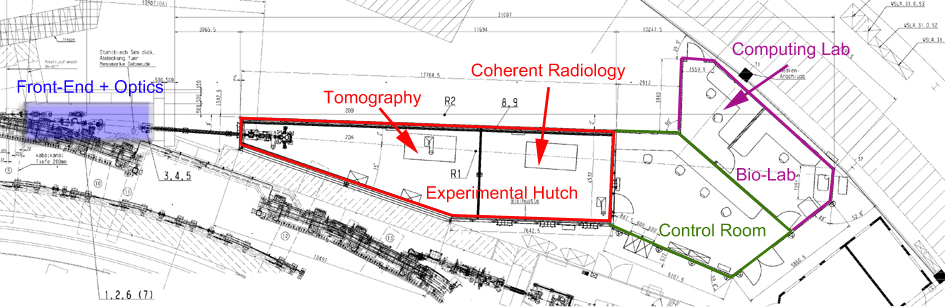
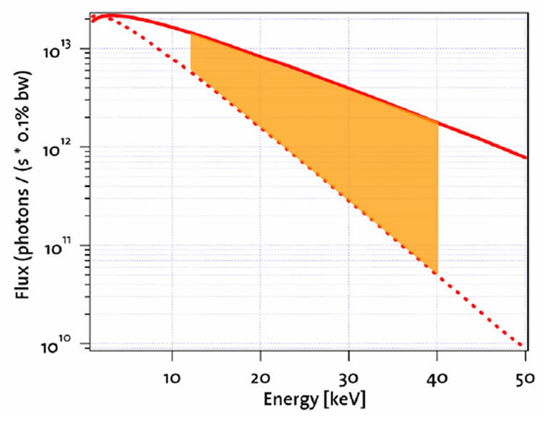
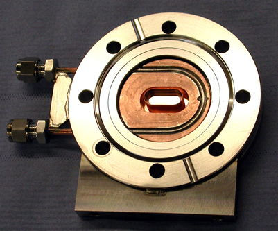
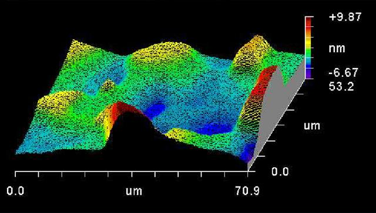
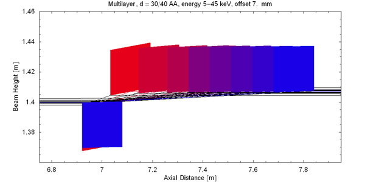
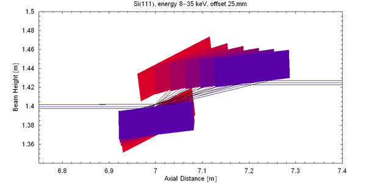
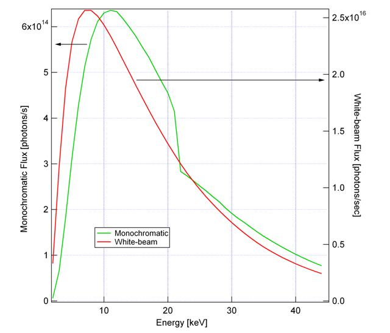

This repository aims to be a public, updatable, version controlled document describing the [TOMCAT beamline](http://psi.ch/sls/tomcat) at the [Swiss Light Source](http://psi.ch/sls).

# Beamline layout
The TOMCAT beamline is located at the X02DA port of the SLS, between the Infrared and the ADRESS beamline.

TOMCAT's frontend accommodates some filters and the monochromator.
A large (17 m long) experimental hutch hosts two experimental station.
Close to the control room a Bio-Lab allows for basic sample preparation while a small Computer Lab offers offline data analysis capabilities.

# Source
TOMCAT gets photons from a 2.9 Tesla superbending magnet.

This leads to a critical energy of 11.1 keV which is much higher than the 5.4 keV of the normal bending magnets installed in the SLS ring.
As a result the flux at high energies is dramatically increased.

The critical energy of the 2.9 T superbend is 11.1 keV (compared to the 5.4 keV of the normal bend installed at SLS), resulting therefore in a considerable shift of the emission spectrum towards high energies photons.
The most relevant source parameters are summarized in the table below.

Info                                            | Details
----------------------------------------------- | -------
Magnetic Field                                  | 2.9 T
Critical Energy                                 | 11.1 keV / 0.112 nm
Electron source size                            | 46 um, 16 um
Electron source divergence                      | 109 urad, 16 urad
Photon source size                              | 53 um, 16 um
Photon source divergence (tailored by aperture) | 2mrad, 0.6 mrad

# Optics
*Rationale*: Real space, full field imaging, and in particular tomography, needs a homogeneous and stablebeam profile, in order to perform optimal background corrections.
Because of the high coherence of the radiation produced by third-generation synchrotron radiation facilities like the SLS, all the optical components (windows, mirrors and monochromator) must be designed with particular care in order to avoid deterioration of the beam profile.
The design criteria for the optics of the TOMCAT beamline have been:

- Keep the optics as simple as possible (i.e. minimize the number of optical elements)
- Optimize optics for bandwidth rather than for energy resolution
- Monochromatic beam and white beam must be available
- Energy range: 6-45 keV 

*Window*: The machine UHV-sector (10-10 mbar) is separated from the beamline HV (10-7 mbar) by a Chemical Vapour Deposited (CVD) diamond window.

Because of their better surface-roughness, CVD diamond windows are preferred to standard Be-windows.
The thickness of the window is 100 um and its surface-roughness 2.5 nm RMS.
Coherence degradation due to the window has been measured with shearing interferometry and resulted to be negligible.

*Optics*: The main optical component of the TOMCAT beamline is a fixed-exit double crystal multilayer monochromator (DCMM) which covers an energy range from 6 to 45 keV.
Design and manufacturing have been done by CINEL Strumenti Scientifici, Padova, Italy.
The DCMM is located in the front-end, at approximately 7 m from the source: this allows to accept a large angular divergence while keeping the optical elements very compact.
[Ru/C]100 and a [W/Si]100 multilayer stripes have been coated 8 mm apart from each other on a Si111 substrate (active area of 150x50 mm2).
As a result the energy bandwidth of the DCMM is a few percent when multilayer are used or 10-4 when the silicon is used.
The slope errors figures in the direction along and across the optic are better than 0.5 urad RMS and 5 urad RMS respectively.
Surface roughness is less than 0.3 nm RMS.
When operating with multilayers the Bragg angle varies between theta = 1.82° and theta = 0.265° for energies ranging from 5 keV up to 45 keV.
For the low-energy settings, the power density is 80 mW/mm2 and is dissipated via a water side-cooling.
The crystal optics are mounted on two independent high-precision goniometers.
The first crystal has motorized pitch, roll, and horizontal translation (for stripes selection); the second crystal has the same degrees of freedom and, in addition, yaw and vertical translation.
The whole system is positioned on a base plate that can be vertically adjusted.
The distance between both crystals can be increased up to 850 mm.
Instead of using a collimating mirror, the vertical size of the beam is ”controlled” by moving the endstation along the beam path (up to 15 m travel range).

![Left: View of the sector 2 of the SLS tunnel: visible are the magnets of the storage ring (in the foreground) as well as the TOMCAT’s front end (background). The monochromator vacuum chamber is clearly visible on the right side. Right: View of the mechanics of the mono: the multilayer crystals are mounted on two separate goniometer towers. The first crystal can be adjustd in transversal direction as well as pitch and roll. The second crystal has transversal, longitudinal (up to 850 mm range), vertical as well as pitch, roll and yaw adjustment. Both crystals are supported by a bank which is vertical translated and tilted by three jacks.](img/mono_into_frontend_mono_open.jpg)

*Monochromatic Operation*: The expected multilayer/crystal translations are shown below.
The beam offset will be between 7 and 10 mm for multilayers and 25 mm for the Si111.

Info                                | Details
----------------------------------- | -------
Energy Range                        | 8-45 keV
Energy bandwidth                    | 2-3 % with multilayers
Energy bandwidth                    | 0.018% with Si111
Photon Flux (ph/s) with multilayers | more than 5 x 1014 @ 10 keV
Photon Flux (ph/s) with multilayers | more than 3 x 1014 @ 20 keV
Photon Flux (ph/s) with multilayers | more than 1 x 1014 @ 40 keV
Beam Size @ 20 m from source        | 40 mm (H) x 7-4 mm (V) for energies between 10-30 keV 

*White beam operation*: The DCMM can be easily removed from the beam path and white beam radiation can be provided at the enstation.
Four quadruple and one triple filters batteries are available to pre-condition the radiation.

Info                         | Details
---------------------------- | -------
Beam Size @ 20 m from source | 40 mm (H) x 9 mm (V)
Filter Battery 0             | 5 mm pyrolitic graphite, 20 mm pyrolitic graphite, 20 mm pyrolitc graphite + 75 um Pd
Filter Battery 1             | 100 um, 200 um, 400 um Al, 20 um Cu
Filter Battery 2             | 50 um Al, 10 um, 40 um, 50 um Al
Filter Battery 3             | 10 um , 50 um Fe, 10 um Cu, 100 um Al
Filter Battery 4             | 10 um Cu, 100 um Al, 200 um Al 

# Endstations
The TOMCAT endstation for microtomography allows translation along all the three space direction is performed with a resolution better than 1 micron.
The axis perpendicular to the beam direction has a reproducibility of 0.1 micron: this is imperative for an artefact-free acquisition of reference images.
The sample can be centered also with 0.1 micron reproducibility.
The rotation axis is air-bearing based and has a run-out error of less then 1 micron at 100 mm from the rotation surface.
The whole system can be swapped by 90◦, allowing to scan thick and short sample (vertical rotation axis) or long and thin samples (horizontal rotation axis).

## Standard configuration for absorption based and edge-enhanced radiography and tomography 
Mainly used for classic absorption tomography and propagation-based phase contrast imaging

### Standard Configuration for Elevated Temperature In-Situ Tomographic Microscopy 
TODO: Fill in info

### Fast shutter
This humongous thing that Rajmund mentioned

### Aerotech stage
This is a very fast and stable rotation stage, provided by [Aerotech](http://www.aerotech.com/).

## Configuration for Differential Phase Contrast (DPC) Imaging.
Mainly used for differential phase contrast imaging.

## Sample manipulator
The sample manipulator has been designed and manufactured at PSI.
The major properties are summarized here:

Info                       | Details
-------------------------- | -------                   
Translation along X,Y,Z    | Reproducibility better than 1 micron
Centering motors (XX,ZZ)   | Reproducibility better than 0.1 micron
Rotation axis (Airbearing) | Runout < 1 um at 100 mm
Rotation speed             | Up to 3600°/sec 

The whole system can be swapped by 90°, allowing to scan thick and short sample (vertical rotation axis) or long and thin samples (horizontal rotation axis).
Please contact the beamline responsible if you intend to use a horizontal rotation axis, this is not the standard operation mode.
Additional details on sample mounting and sample environment can be found here.

TODO: Nanoscope
TODO: Ultrafast endstation

# Detectors
## Scintillators
Depending on user requirements (optimize for speed or resolution) several scintillator are available.
In particular:

       | Thickness (um) | Resolution | Speed
------ | -------------- | ---------- | -----
YAG:Ce | 20  | Good      | Good
YAG:Ce | 150 | Medium    | Fast
YAG:Ce | 300 | Poor      | Very Fast
LAG:Eu | 5   | Excellent | Slow
LAG:Eu | 10  | Very Good | Medium
LAG:Eu | 25  | Good      | Good
CdWO4  | 300 | Poor      | Very Fast 

## Readout electronics

          | Physical pixel size [um] | Total pixel size
--------- | ------------------------ | ----------------
pco.Dimax | 6.5 | 2048 x 2048
pco.Edge  | 5.5 | 2560 x 2160
pco.Edge  | 4.5 | 2560 x 2160
pco.2000  | ?   | ?

## Microscopes
The TOMCAT endstation features two detector configurations, covering a field of view ranging from 0.75x0.75 mm2 up to 15.1x15.1 mm2.
Both optical system have been manufactured by Optique-Peter in Lyon, France.

* MS1
* MS2
* 1:1-Optics

## Objectives

           | Magnification | Numerical Aperture | Field of view (mm2) | Pixel Size (um2)
---------- | ------------- | ------------------ | ------------------- | ----------------
PLAPO1.25x | 1.25 | 0.06 | 12.1x12.1 | 5.92x5.92
PLAPO2x    | 2    | 0.08 |	7.5x7.5   | 3.7x3.7
UPLAPO4x   | 4    | 0.16 | 3.7x3.7   | 1.85x1.85
UPLAPO10x  | 10   | 0.40 | 1.5x1.5   | 0.74x0.74
UPLAPO20x  | 20   | 0.70 | 0.75x0.75 | 0.37x0.37

## Data-crunching and reconstruction 
Tomographic data are post-processed online and reconstructions are available immediately after a scan for quality control.
Data are exported as TIFF (8bit or 16bit) or in raw binary format (16 bit float) on request.
